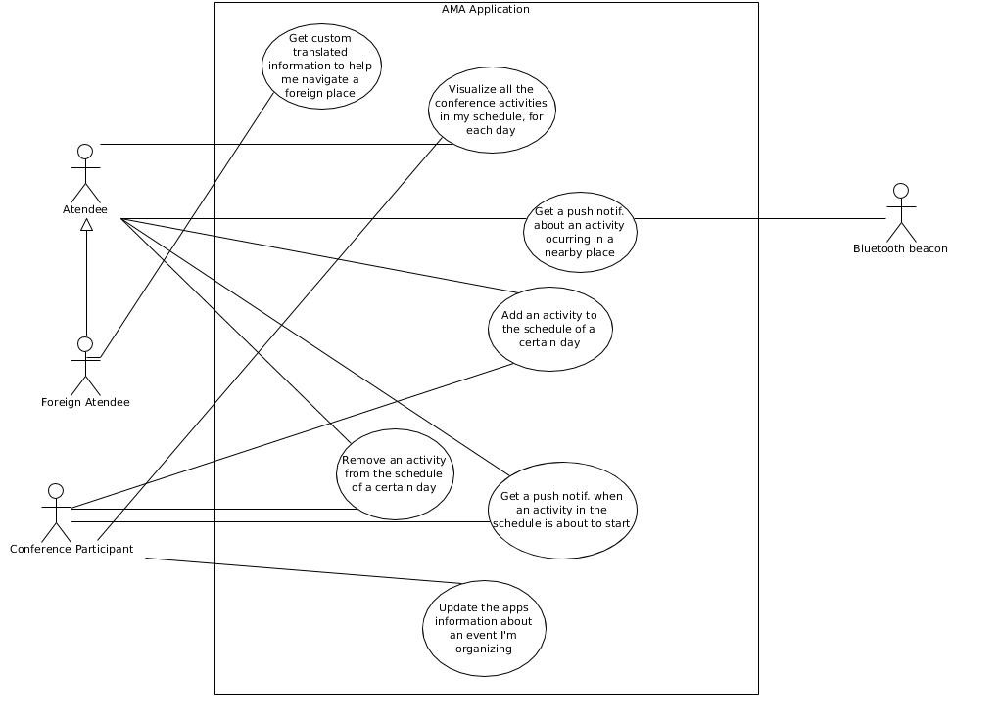

# openCX-*Mr Simba* Development Report

Welcome to the documentation pages of the Agenda Mobile App of **openCX**!

You can find here detailed information about the (sub)product, hereby mentioned as module, from a high-level vision to low-level implementation decisions, a kind of Software Development Report (see [template](https://github.com/softeng-feup/open-cx/blob/master/docs/templates/Development-Report.md)), organized by discipline (as of RUP): 

* Business modeling 
  * [Product Vision](#Product-Vision)
  * [Elevator Pitch](#Elevator-Pitch)
* Requirements
  * [Use Case Diagram](#Use-case-diagram)
  * [User stories](#User-stories)
  * [Domain model](#Domain-model)
* Architecture and Design
  * [Architectural and design decisions]()
  * [Technological architecture]()
  * [Logical architecture]()
* Implementation
  * [Source code]()
  * [Issues](): feature requests, bug fixes, improvements.
* Test
  * [Automated tests](): Functional tests, integration tests, acceptance tests, as much automated as possible.
* Change management
  * [Issues at Github]()
* Project management
  * Tasks management tool 

So far, contributions are exclusively made by the initial team, but we hope to open them to the community, in all areas and topics: requirements, technologies, development, experimentation, testing, etc.

Please contact us! 

Thank you!

*David Silva*  
*Eduardo Ribeiro*  
*Luís Cunha*  
*José Gomes*

## Product Vision

A mobile app connected with the event-space to let the atendees organize themselves better and allow them to better manage their time, so they can get the best out of the conference.

## Elevator Pitch

### Version 1.a
Our idea for a product that would let the atendees of the conference have a better experience is an agenda application that lets the participants to better organize their schedule. Our app will let the users plan their schedule for each one of the 4 days of the conference. They can of course add and remove activities from their schedule as they will.

Also, to remind the user that an activity is about to begin, the app will send a push notification approximately 5/10 mins before each activity, so they don't forget it.

However, what sets us apart from other agenda apps is our use of bluetooth beacons, that are distributed throughout the different rooms and areas of the conference. If a user gets close to one of them, and an activity will start shortly in that area, they will receive a push notification warning them about it, so they are informed about everything that is happening around them.

### Version 1.b
Have you ever found yourself in a conference spending more time keeping track of events and getting accquainted to the venue rather than networking and getting knowledge?
Our solution for that is an agenda app for your smartphone that lets you, as a participant, organize you schedule. The app let's you plan out your daily activities and warns you before it's time to do them.

However, what sets us apart from other agenda apps is our use of bluetooth beacons, that are distributed throughout the different rooms and areas of the conference. If you get close to one of them, and an activity will start shortly in that area, you will receive a push notification warning you about it, so that you are connected with everything that is happening around you.

## Requirements

In this section, you should describe all kinds of requirements for your module: functional and non-functional requirements.

Start by contextualizing your module, describing the main concepts, terms, roles, scope and boundaries of the application domain addressed by the project.

### Use case diagram 

 

Briefly describe each use case mentioning the following:

* **Actor**. Name only the actor that will be initiating this use case, i.e. a person or other entity external to the software system being specified who interacts with the system and performs use cases to accomplish tasks. 
* **Description**. Provide a brief description of the reason for and outcome of this use case, or a high-level description of the sequence of actions and the outcome of executing the use case. 
* **Preconditions and Postconditions**. Include any activities that must take place, or any conditions that must be true, before the use case can be started (preconditions) and postconditions. Describe also the state of the system at the conclusion of the use case execution (postconditions). 

* **Normal Flow**. Provide a detailed description of the user actions and system responses that will take place during execution of the use case under normal, expected conditions. This dialog sequence will ultimately lead to accomplishing the goal stated in the use case name and description. This is best done as a numbered list of actions performed by the actor, alternating with responses provided by the system. 
* **Alternative Flows and Exceptions**. Document other, legitimate usage scenarios that can take place within this use case, stating any differences in the sequence of steps that take place. In addition, describe any anticipated error conditions that could occur during execution of the use case, and define how the system is to respond to those conditions. 

### User stories
This section will contain the requirements of the product described as **user stories**, organized in a global **user story map** with **user roles** or **themes**.

For each theme, or role, you may add a small description here. User stories should be detailed in the tool you decided to use for project management (e.g. trello or github projects).

A user story is a description of desired functionality told from the perspective of the user or customer. A starting template for the description of a user story is 

*As a < user role >, I want < goal > so that < reason >.*

You add more details after, but the shorter and complete, the better. In order to decide if the user story is good, please follow the INVEST guidelines.

After the user story text, you should add a draft of the corresponding user interfaces, a simple mockups or drafts, if applicable.

For each user story you should write also the acceptance tests (textually in Gherkin), ie, a description of situations that will help to confirm that the system satisfies the requirements addressed in the user story.

At the end, it is good to add a rough indication of the value of the user story to the customers (e.g. MoSCoW method) and the team should add an estimative of the effort to implemente it, in t-shirt sizes (XS, S, M, L, XL).

### #1
> Como participante ou orador da conferência, queria que a aplicação me ajudasse a encontrar as atividades que possam ser do meu interesse, e que mantivesse a minha agenda/horário com os vários dias, de modo a melhorar a minha organização.

### #2
> Os utilizadores devem poder fazer o seu próprio horário personalizado para cada dia, de acordo com os seus interesses.
> 
### #3
> Os utilizadores devem ser informados do começo de uma sessão que esteja no horário, alguns minutos antes de tal, de modo a estes não perderem as suas atividades de interesse.

### #4
> Como participante estrangeiro da conferência, não conhecendo bem o meio em que esta está a decorrer, gostaria de saber quando é que passo por sítios/locais em que estão a/irão decorrer atividades do meu interesse.

### #5
> Como participante na conferência, gostaria de poder criar as minhas próprias atividades e adicioná-las ao horário (ex: almoçar, encontrar-me com conhecidos, reuniões, etc), de modo a poder ter na aplicação tudo o que fizer que for relacionado com a conferência.

### #6
>Indicação por parte do utilizador de certas áreas de interesse, sendo que a app sugere certas sessões que tenham a ver

### #7
>triangulação com beacons para o utilizador saber onde está

### #8
>"modo organizador" que utiliza as informações de localização para oferecer insights aos organizadores sobre o estado do seu evento

### #9
>sistema de "amigos" que utiliza os beacons para informar os utilizadores da presença de "colegas" na conferência

### #10
>advertising através de push notifications pelos beacons

### Domain model

A simple UML class diagram with all the key concepts (names, attributes) and relationships involved of the problem domain addressed by your module.

### Useful links

To learn more about how to write a good product vision, please see also:
* [How To Create A Convincing Product Vision To Guide Your Team, by uxstudioteam.com](https://uxstudioteam.com/ux-blog/product-vision/)
* [Product Management: Product Vision, by ProductPlan](https://www.productplan.com/glossary/product-vision/)
* [Vision, by scrumbook.org](http://scrumbook.org/value-stream/vision.html)
* [How to write a vision, by dummies.com](https://www.dummies.com/business/marketing/branding/how-to-write-vision-and-mission-statements-for-your-brand/)
* [20 Inspiring Vision Statement Examples (2019 Updated), by lifehack.org](https://www.lifehack.org/articles/work/20-sample-vision-statement-for-the-new-startup.html)

To learn more about how to write a good elevator pitch take a look at the following links to learn some techniques:
* [Crafting an Elevator Pitch](https://www.mindtools.com/pages/article/elevator-pitch.htm)
* [The Best Elevator Pitch Examples, Templates, and Tactics - A Guide to Writing an Unforgettable Elevator Speech, by strategypeak.com](https://strategypeak.com/elevator-pitch-examples/)
* [Top 7 Killer Elevator Pitch Examples, by toggl.com](https://blog.toggl.com/elevator-pitch-examples/)