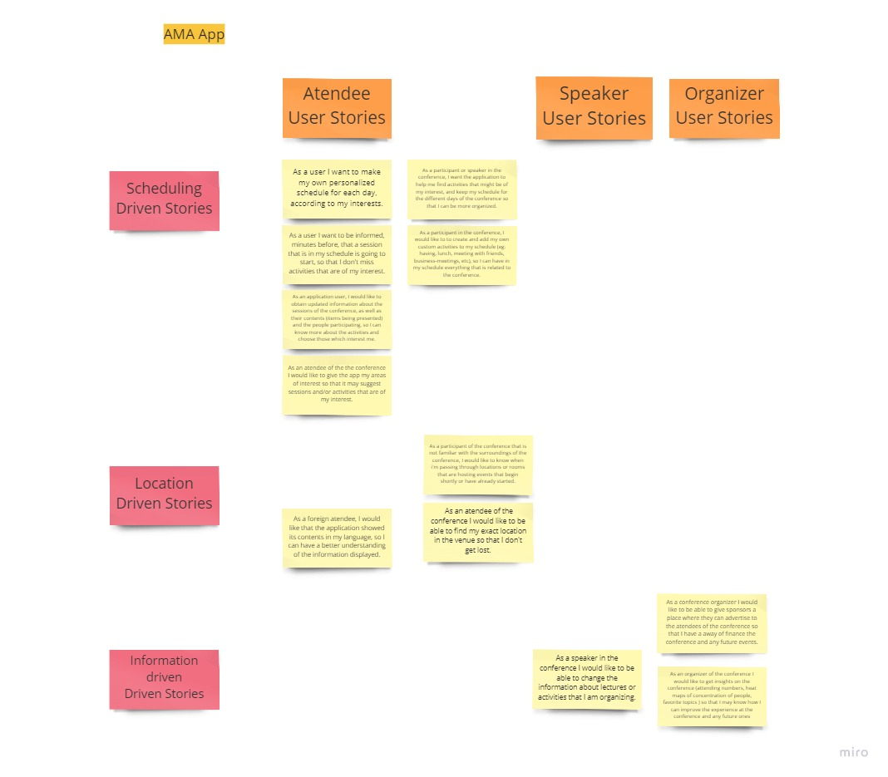
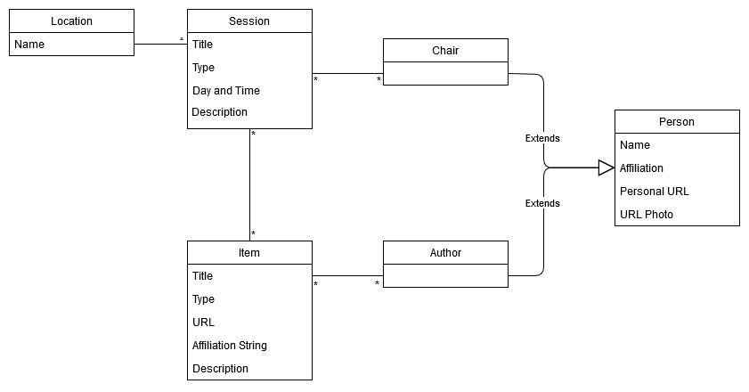
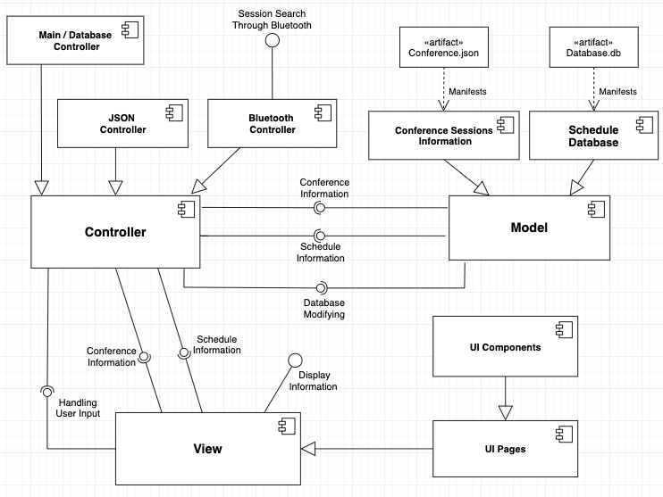
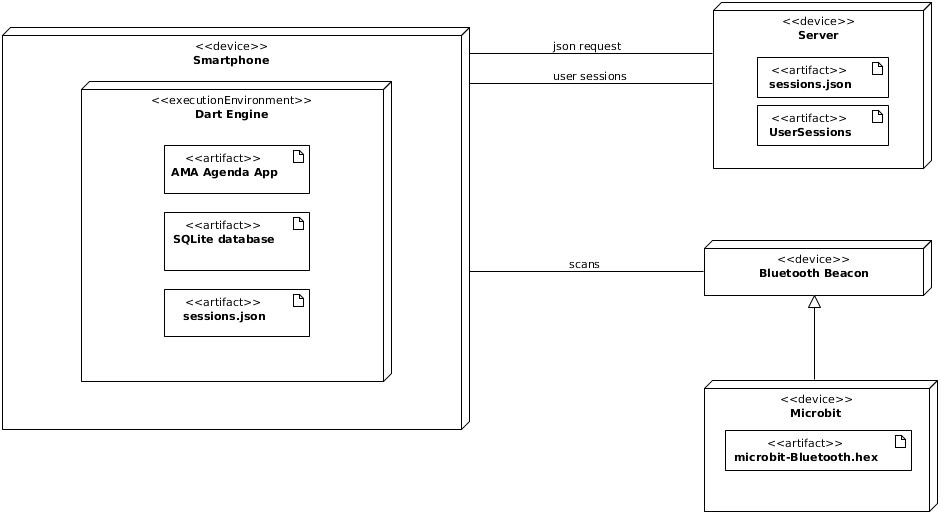
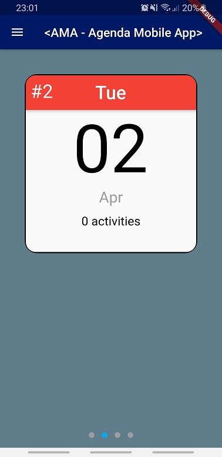
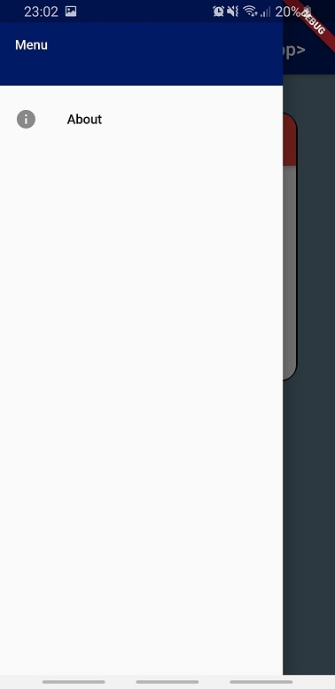
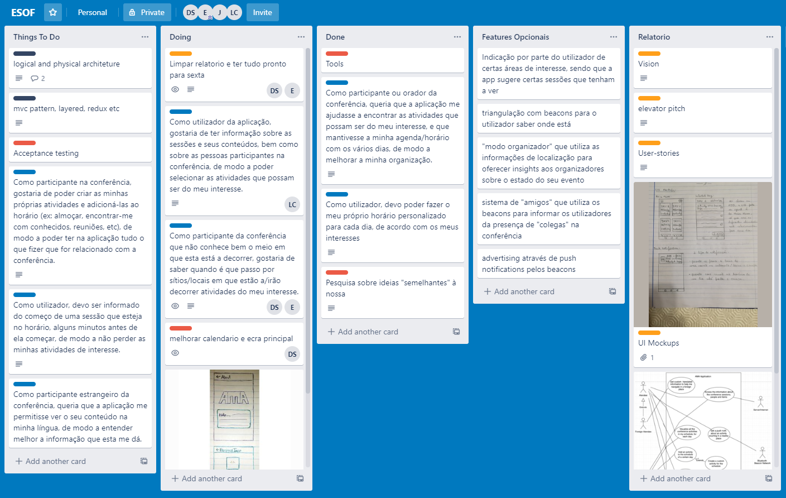

# openCX-*Mr Simba* Development Report

Welcome to the documentation pages of the Agenda Mobile App of **openCX**!

You can find here detailed information about the (sub)product, hereby mentioned as module, from a high-level vision to low-level implementation decisions, a kind of Software Development Report (see [template](https://github.com/softeng-feup/open-cx/blob/master/docs/templates/Development-Report.md)), organized by discipline (as of RUP): 

* Business modeling 
  * [Product Vision](#Product-Vision)
  * [Elevator Pitch](#Elevator-Pitch)

* Requirements

  * [Use Case Diagram](#Use-case-diagram)
  * [User stories](#User-stories)
  * [UI Mockups](#UI-Mockups)
  * [Domain model](#Domain-model)

* Architecture and Design
  * [Architectural and design decisions]()
  * [Technological architecture]()
  * [Logical architecture](#Logical-architecture)
  * [Physical architecture](#Physical-architecture)
  * [Prototype](#Prototype)
    * [Images of prototype for iteration #1](#Images-of-prototype-for-iteration-#1)

* Implementation

  * [Source code]()
  * [Issues](): Feature requests, bug fixes, improvements.

* Test

  * [Automated tests](): Functional tests, integration tests, acceptance tests, as much automated as possible.

* Change management

  * [Issues at Github]()

* Project management

  * [Tasks management tool](#Project-management) 

So far, contributions are exclusively made by the initial team, but we hope to open them to the community, in all areas and topics: requirements, technologies, development, experimentation, testing, etc.

Please contact us! 

Thank you!

*David Silva*  

*Eduardo Ribeiro*  

*José Gomes*  

*Luís Cunha*  

## Product Vision

"A mobile app connected with the event-space to let the atendees organize themselves better and allow them to better manage their time, so they can get the best out of the conference."

## Elevator Pitch

Here are shown the several iterations of the elevator pitch, so that you can see the evolution of the concept and of the way of presenting it.

### Version 1.a

Our idea for a product that would let the atendees of the conference have a better experience is an agenda application that lets the participants to better organize their schedule. Our app will let the users plan their schedule for each one of the 4 days of the conference. They can of course add and remove activities from their schedule as they will.

However, what sets us apart from other agenda apps is our use of bluetooth beacons, that are distributed throughout the different rooms and areas of the conference. If you get close to one of them, and an activity will start shortly in that area, you will receive a push notification warning you about it, so that you are connected with everything that is happening around you."

However, what sets us apart from other agenda apps is our use of bluetooth beacons, that are distributed throughout the different rooms and areas of the conference. If a user gets close to one of them, and an activity will start shortly in that area, they will receive a push notification warning them about it, so they are informed about everything that is happening around them.""

### Version 1.b

"Have you ever found yourself in a conference spending more time keeping track of events and getting accquainted to the venue rather than networking and getting knowledge?

Our solution for that is an agenda app for your smartphone that lets you, as a participant, organize you schedule. The app let's you plan out your daily activities and warns you before it's time to do them.

However, what sets us apart from other agenda apps is our use of bluetooth beacons, that are distributed throughout the different rooms and areas of the conference. If you get close to one of them, and an activity will start shortly in that area, you will receive a push notification warning you about it, so that you are connected with everything that is happening around you."

### Version 2.a

"Have you ever found yourself in a conference spending more time keeping track of events and getting accquainted to the venue rather than networking and getting knowledge?
Our solution for that is an agenda app for your smartphone that lets you, as a participant, organize you schedule. The app let's you plan out your daily activities and warns you before it's time to do them.

However, what sets us apart from other agenda apps is that our app is connected with the event space and, as such, you get custom location-related notifications. If you get close to one of them, and an activity will start shortly in that area, you will receive a push notification warning you about it, so that you are connected with everything that is happening around you."

## Requirements

As an agenda application, the main requirements of our product are connected to the display of information about the conference, to the customization of the schedules by the user and the warning/notification that an event in the schedule is about to begin. This information must be displayed in a manner that is aesthetically appealing and intuitive to the main user(conference-attendee). Moreover, our requirements are also influenced by the technologies that we are going to use, more specifically the use of bluetooth beacons to inform the user about nearby sessions and events, and the parsing, querying and display of the informations stored in a JSON file. As a mobile application the product needs to have a performance tailored to the capabilities of smarthphones.

### Use case diagram 

Description of the use cases shown:

####  **Visualize all the conference activities in my schedule, for each day**

* **Actor**: Atendee and conference participant 

* **Description**: The users of our application need to see and know what are the various sessions in each day's schedule.

* **Preconditions and Postconditions**: The schedules need to have at least one activity in them; besides that, there are no major preconditions necessary for the use case's execution.

* **Normal Flow**:
        
    1. User, while in the main screen, navigates between the icons relative to each of the 4 days of the conference, by swiping left or right in the main screen.
    2. User taps on 1 of the 4 icons.
    3. App displays the schedule for that day.

* **Alternative Flows and Exceptions**: If the schedule for a given day is empty, the app will show some text explaning that to the user, and indicating how he or she can add sessions and activities to the schedule.

####  **Add an activity to the schedule of a certain day**

* **Actor**: Atendee and conference participant 

* **Description**: The users of our application need to be able to add sessions and activities to their schedule, so they can customize it as they wish.

* **Preconditions and Postconditions**: The system needs to have the correct and updated information to show the user, regarding the activities for that day, so that the app user can choose those which might be of their interest.

* **Normal Flow**:
        
    1. System is displaying the different activities of the conference for that day.
    2. User picks the activity that he/she wants and swipes to the left, revealing an "add" button.
    3. User clicks the button.
    4. System redirects to the schedule page, showing that the activity was indeed added.

* **Alternative Flows and Exceptions**: If the user tries to add an activity that is already in the schedule, it obviously will have no effect.

####  **Create a custom activity for the schedule**

* **Actor**: Atendee and conference participant

* **Description**: This can be considered as a sub-use case of adding an activity. The goal is to let the users of the application have in their schedule not only the sessions that they want to attend, but also every other activity related to the conference, such as, for example, a meeting, a reunion, having lunch, etc.

* **Preconditions and Postconditions**: There are no major preconditions that have to be met before the start of this use case. After its execution, the activity crated will be added to the day's schedule.

* **Normal Flow**:
        
    1. User selects the option to create a custom activity, in the schedule of a given day.
    2. User inputs the needed fields to characterize the custom session (title, location, start time, etc).
    3. System creates the custom event and adds it to the schedule

* **Alternative Flows and Exceptions**: If the user enters any invalid input or any required fields are left blank, the application will not create the custom activity and will ask the user to fill in all the fields correctly.

####  **Remove an activity from the schedule of a certain day**

* **Actor**: Atendee and conference participant 

* **Description**: The users of our application need to be able to remove sessions and activities from their schedule, so they can customize it as they wish.

* **Preconditions and Postconditions**: There must be, obviously, at least one activity in the schedule, if we want to remove.

* **Normal Flow**:
        
    1. System is displaying the different activities of the schedule.
    2. User picks the activity that he/she wants and swipes to the left, revealing a "remove" button.
    3. User clicks the button.
    4. System deletes that session from the schedule, no longer displaying it.

* **Alternative Flows and Exceptions**: As said before, is the schedule has no activities, the user can't remove anything.

####  **Get a push notification when an activity in the schedule is about to start**

* **Actor**: Atendee and conference participant 

* **Description**: In order to remind the user that an activity in the schedule is about to start, roughly 10 minutes before said activity the app will generate a push notification with that information.

* **Preconditions and Postconditions**: The app must know the current time and at what time the activity starts, so as to calculate how much time left there is before the session starts, and to know when to warn the user.

* **Normal Flow**:
        
    1. System compares current time to the start time of the sessions in the schedule.
    2. System detects that in less than 10 minutes a session will begin.
    3. Application generates a push notification to warn the user.
    4. User sees the push notification and is informed.

* **Alternative Flows and Exceptions**: As said before, if the application cannot keep track of time, no notification is going to be generated.

####  **Get custom translated information to help me navigate in a foreign place**

* **Actor**: Foreign atendee 

* **Description**: In order to accommodate and help foreign atendees, the app should be able to display its content in several languages.

* **Preconditions and Postconditions**: There are no major preconditions for this use case. In terms of postconditions, after the language change, all text the system displays will be in that language.

* **Normal Flow**:
        
    1. User goes to the "language select" menu.
    2. User selects the desired language.
    3. System changes content to be displayed in that language.

* **Alternative Flows and Exceptions**: No major alternative flows and exceptions are expected.

####  **Get a push notification about an activity ocurring in a nearby place**

* **Actor**: Atendee and bluetooth beacon network

* **Description**: In order to integrate the user in the conference environment and inform him/her about some activities that might be of his/her interest, the application (if close enough) will connect with a bluetooth beacon, placed in the different rooms and locations of the conference, generating a push notification if a session in that location is about to begin or is underway.

* **Preconditions and Postconditions**: The phone should be able have the capability to connect with the bluetooth beacons, and the app needs be "aware" of time in order to calculate if a session on that location is about to begin or is underway. Moreover, the beacon must be capable of transmiting the needed information to the application.

* **Normal Flow**:
        
    1. User is in a certain location, staying still or moving around.
    2. Phone is close enough to a bluetooth beacon, connecting itself to it.
    3. Beacon sends to the application information about the next session that is going to take place in that location.
    4. Application calculates that that session is about to begin or is underway.
    5. Application generates push notification to warn the user.
    6. User sees the notification and is informed.

* **Alternative Flows and Exceptions**: If any of the preconditions are not met (for example, phone has bluetooth disabled or beacon cannot send information), this process will not be able to execute and the app will not generate any push notifications. This will also happen, of course, if the phone is out of range of the bluetooth beacons.

####  **Access the information about the conference sessions, people and items**

* **Actor**: Atendee, conference participant and server/internet. 

* **Description**: The users of our application need to see and know what are the various sessions offered by the conference, so they can understand what activities they are interested in, in order to build a schedule.

* **Preconditions and Postconditions**: The system needs to be able to estabilish a connection to the server, in order to get a JSON file contaning all the information. After this use case the user can now choose what sessions he or she wants to add to the schedule.

* **Normal Flow**:
        
    1. User taps button to see the available activities for that day.
    2. App queries the JSON file to get the information about the sessions for that day.
    3. App displays that information to the user.

* **Alternative Flows and Exceptions**: If the application does not have access to the JSON file or the user demands to refresh the page, the system contacts the server in order to get the JSON file.

####  **Update the app's information about an event im organizing**

* **Actor**: Conference participant

* **Description**: In order to maintain and keep all the information about the sessions as recent as possible, the conference participants and speakers should be able to update that information whenever is necessary.

(we are still unsure about how we're going to implement this use case, so we have decided to leave the rest of the fields blank for now).

### User stories

### #1

> "As a participant or speaker in the conference, I want the application to help me find activities that might be of my interest, and keep my schedule for the different days of the conference so that I can be more organized."
>
> * **Importance:** Must have
> * **Effort to implement:** M 

### #2

> "As a user I want to make my own personalized schedule for each day, according to my interests."
>
> * **Importance:** Must have
> * **Effort to implement:** M 

### #3

> "As a user I want to be informed, minutes before, that a session that is in my schedule is going to start, so that I don't miss activities that are of my interest."
>
> * **Importance:** Should have
> * **Effort to implement:** M 

### #4
> "As a participant of the conference that is not familiar with the surroundings of the conference, I would like to know when i'm passing through locations or rooms that are hosting events that begin shortly or have already started."
>
> * **Importance:** Should have
> * **Effort to implement:** L 

### #5
> "As a participant in the conference, I would like to to create and add my own custom activities to my schedule (eg: having, lunch, meeting with friends, business-meetings, etc), so I can have in my schedule everything that is related to the conference."
>
> * **Importance:** Could have
> * **Effort to implement:** S 

### #6
> "As an application user, I would like to obtain updated information about the sessions of the conference, as well as their contents (items being presented) and the people participating, so I can know more about the activities and choose those which interest me."
>
> * **Importance:** Should have
> * **Effort to implement:** M

### #7
> "As an atendee of the the conference I would like to give the app my areas of interest so that it may suggest sessions and/or activities that are of my interest."
>
> * **Importance:** Should have
> * **Effort to implement:** S

### #7
> "As a foreign atendee, I would like that the application showed its contents in my language, so I can have a better understanding of the information displayed."
>
> * **Importance:** Could have
> * **Effort to implement:** M 

### #8
> As an atendee of the conference I would like to be able to find my exact location in the venue so that I don't get lost.
>
> * **Importance:** Could have
> * **Effort to implement:** L

### #9
> As an organizer of the conference I would like to get insights on the conference (attending numbers, heat maps of concentration of people, favorite topics ) so that I may know how I can improve the experience at the conference and any future ones
>
> * **Importance:** Could have
> * **Effort to implement:** M 

### #10
> As an atendee of the conference I would like to be able to add my friends and collegues to a friend's list in the app so that I am aware if people I know are attending the same conference as I am.
>
> * **Importance:** Could have
> * **Effort to implement:** L 

### #11
> As a conference organizer I would like to be able to give sponsors a place where they can advertise to the atendees of the conference so that I have a away of finance the conference and any future events.
> 
> * **Importance:** Could have
> * **Effort to implement:** L 

### #12
> As a speaker in the conference I would like to be able to change the information about lectures or activities that I am organizing.
> 
> * **Importance:** Should have
> * **Effort to implement:** L 

### UI-Mockups

Based on the user-stories described above the following mockups were made. To make them we chose the pencil-and-paper approach as it seemed to have more advantages. First, it lacks the need of having to learn a new mockup-drawing environment (like Adobe XD), second, it allows for a more hands-on workflow of editing the mockups in a group and, lastly, we taught that the cleaner look provided by other mockup-drawing options didn't really be of an advantage as the general look and feel of the app is generaly determined by the environment where it is developed.  
As the development moves forward the mockups will be tailored to specific user-stories and will be shown next to them, as such, this sections will be deleted.

### Domain model

---

## Architecture and Design
In this section, we will be talking and showing more about our architecture, from two points of view: the logical point of view, more related to the high-level logical structure of the code, its components and relations between them; and a more physical point of view, portraying the high-level physical structure such as the machines, connections and technologies used.

### Logical architecture
For the logical structure of the code, and in order to separate the different components of the software, we opted to implement the MVC design: the Model contains all the relevant information, the View displays it, and the Controller serves as a kind of "middle man" between them, getting the information from the Model and passing it to the View, and handling the user input from the View buttons, modifying the Model accordingly. We opted to use a design where the Controller is subdivided into smaller Controller modules (having kind of a layered architecture), each having their own roles and methods (JSON Controller, Database Controller, etc), and where a general Controller module is used to connect all the smaller controllers, functioning as a common interface.

### Physical architecture
The physical structure of our solutions is very straightforward. The AMA app will be installed in the user's smarthphone. The app requests the json that contains the conferences info from the server. After it parses the json, it will store it's information in an SQLite database. The server also holds information about user sessions that it may supply to the user upon request. Tha app also communicates with beacons as discussed in previously (location-driver notifications). Currently we have microbits serving as Eddystone Beacons.

For this project the main discussion was about what environment/programming language to use to build the mobile app. The two choices were Flutter and React Native. Although React Native has been around for longer than Flutter and, as such, the support for the language is big, we chose Flutter because it was very easy to learn as it is very well documented, very powerfull(has built in widgets tailored to every need) and because it is advantegeous to learn a language that might be popular in the future.  
For the database technology we chose SQLite because of it's small computational needs and for it's simplicity (which is more than enough for the needed task).  
Finally, for our bluetooth technology we chose to use the Eddystone protocol because it eliminates the need to pair with the beacon and , as such, enables a dynamic scan as the user moves arround the event-space.

### Prototype  
In iteration #1, we spent a considerable amount of time learning about Flutter. Despite this,
in order to start seeing results and verify our bet on the technologiws we chose, we quickly started implementing 
the basis of the app to deal with our most important user stories. 
Our first prototype consists essentially of the barebone of the agenda part of the app, and it allows
the user to consult conference sessions by day and save the favourites in a personalized list.
The implemented user stories were #1 and #2. These stories are closely related and were implemented by having
a button in the main screen for each day of the conference, allowing the user to navigate to a screen where his
favourite sessions for that given day are shown (user story #2). In this screen, by pressing the ADD button, 
the attendee can consult information about all of the sessions for that day (user story #1), and add the ones that interest him the most
to his personal schedule.

In iteration #2 the goal is to start developing the BLE(Bluetooth Low Energy) module and to continue the scheduling section. In the following iteration the architectural and design aspects of the product will be defined in detail.

#### Images of prototype for iteration #1

## Implementation  

Due to a big portion of the first iteration being spent learning Flutter, and although we have developed some features, the code that was implemented is not properly structured and is on a early development stage , as such, this section will be detailed in the following iteration.

---
## Test  

---
## Configuration and change management

---

## Project management

The project management tool that we decided to adopt was Trello.

The project management tool that we decided to adopt was Trello. Because it is simple to use, free and as a lot of usefull functionalities such as setting deadlines, adding attachements adding responsitbilities and notifications.

